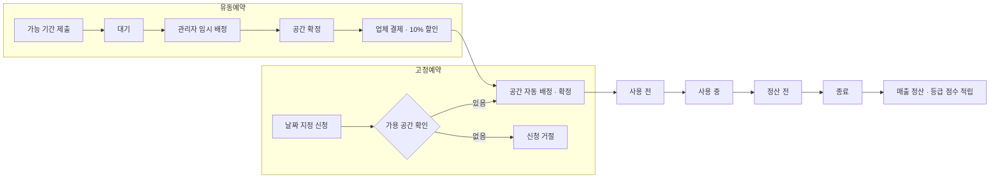

# ☕ Pop-up Coffee

> 팝업 스토어 공간을 대여·운영하는 사업자를 위한 **공간 예약 및 정산 관리 시스템**

입점 업체의 예약부터 공간 배정, 대여 진행, 매출 정산, 등급 관리까지 팝업 스토어 운영의 전 과정을 하나의 서비스로 관리합니다.

<p>
  
  
  
  
  
</p>

**동서대학교 데이터베이스 설계 8조 팀 프로젝트** · 2023.12 · 팀원 5명

---

## 📖 프로젝트 소개

팝업 스토어 공간 운영사는 여러 업체의 예약을 받아 한정된 공간에 배정해야 합니다. 이때 두 가지 문제가 생깁니다.

1. **날짜가 확정된 예약만 받으면 공간 활용률이 떨어집니다.** "언제든 3일만 쓸 수 있으면 된다"는 업체를 놓치게 됩니다.
2. **요금 정책이 단순하면 수익이 최적화되지 않습니다.** 성수기와 비수기, 공휴일, 단골 업체 할인을 모두 반영해야 합니다.

Pop-up Coffee는 이 문제를 **고정 예약 / 유동 예약 이원화**와 **성수기·등급 기반 요금 정책**으로 해결합니다.

---

## 🎯 핵심 도메인 개념

### 1. 두 가지 예약 방식

| | **고정 예약 (Fixed)** | **유동 예약 (Flexible)** |
|---|---|---|
| 방식 | 업체가 원하는 날짜를 직접 지정 | 가능한 기간과 희망 일수만 제출 |
| 공간 배정 | 신청 즉시 자동 배정 | 관리자가 남는 자리에 수동 배정 |
| 확정 시점 | 신청과 동시에 확정 | 관리자 배정 → 업체 결제 시 확정 |
| 혜택 | — | **대여료 10% 추가 할인** |

유동 예약은 확정되는 순간 내부적으로 고정 예약으로 전환되어(`FixedReservation.of(...)`), 이후 대여·정산 흐름은 하나로 통일됩니다.

### 2. 요금 산정 구조

대여료는 **하루 단위로 계산해 합산**합니다.

```
일일 요금 = 기본 대여료(100,000원)
           + 성수기 가산 (최성수기 +75,000 / 성수기 +50,000 / 비수기 -25,000)
           + 공휴일 가산 (+25,000)

총 대여료 = Σ(일일 요금) × (100 - 업체 등급 할인율) / 100
보증금   = 대여 일수 × 50,000원
```

### 3. 업체 등급 제도

대여 일수와 매출에 따라 **등급 점수**가 누적되고, 점수 구간에 따라 등급이 자동으로 결정됩니다. 등급이 높을수록 **대여료는 싸지고 수수료는 낮아집니다.**

| 등급 | 최소 점수 | 대여료 할인 | 매출 수수료 |
|---|---:|---:|---:|
| 🤍 WHITE | 0 | 2% | 30% |
| 💚 GREEN | 250 | 5% | 25% |
| 💜 PURPLE | 500 | 10% | 20% |
| ⭐ VIP | 1,000 | 20% | 10% |

> 점수 적립: 대여 1일당 5점 + 매출 5,000원당 1점, 첫 대여 시 보너스 200점

---

## ✨ 주요 기능

### 👔 입점 업체 (Merchant)
- 회원가입 / 로그인, 계약 등록
- 고정·유동 예약 신청 및 실시간 예상 요금 조회
- 예약 내역 조회 및 취소, 유동 예약 결제
- 마이페이지 — 현재 등급, 다음 등급까지 남은 점수·매출·대여일수 안내

### 🛠 운영 관리자 (Admin)
- **공간 배정 관리** — 예약 요청을 남는 공간에 배정·해제·기간 변경
- **대여 상태 관리** — 사용 전 → 사용 중 → 정산 전 → 종료 단계 진행
- **성수기 설정** — 연 단위 날짜 정보 생성 후 날짜별 성수기 등급·공휴일 지정
- **자동 정산** — 대여 종료 시 매출에서 등급별 수수료를 차감해 정산 내역 생성
- **업체 관리** — 매출 순위 랭킹, 경고·블랙리스트 관리
- **만족도 설문 관리** — 문항 구성 및 응답 통계(파이 차트) 확인

### 🙋 일반 회원 (Member)
- 팝업 스토어 상품 주문 및 포인트 결제 (결제액의 10% 적립)
- 만족도 설문 참여 시 500포인트 지급
- 문의 등록 및 답변 확인

---

## 🔄 예약 처리 흐름



---

## 🛠 기술 스택

| 구분 | 기술 |
|---|---|
| 언어 | Java 17 |
| 프레임워크 | Spring Boot 3.1.6, Spring Data JPA |
| 쿼리 | QueryDSL 5.0 (Jakarta) |
| 뷰 | Thymeleaf, JavaScript, Chart.js |
| 데이터베이스 | MySQL |
| 빌드 | Gradle |
| 협업 | Git, GitHub |

---

## 📂 프로젝트 구조

도메인 단위로 패키지를 나누고, 각 도메인 안에서 `controller / service / repository / domain` 계층을 유지합니다.

```
com.db8.popupcoffee
├── merchant/       # 입점 업체, 등급(Grade), 업종
├── member/         # 일반 회원, 포인트 내역
├── contract/       # 업체 계약
├── reservation/    # 고정 예약 · 유동 예약 · 희망 날짜
├── space/          # 공간, 공간 배정 (QueryDSL 가용 공간 조회)
├── rental/         # 대여 계약, 대여 상태 전이
├── settlement/     # 상품 주문, 매출 정산
├── seasonality/    # 날짜별 성수기 등급 · 공휴일 정보
├── survey/         # 만족도 설문, 응답 통계
├── inquiry/        # 문의 · 답변
├── sanction/       # 경고 · 블랙리스트 이력
└── global/         # 공통 엔티티, 요금 계산기, 정책 상수, 설정
```

---

## 🔍 핵심 구현

### 1. 함수형 인터페이스로 표현한 성수기 요금 정책

성수기 등급마다 요금 계산식이 다른 점을 `enum` + 함수형 인터페이스로 표현해, 등급 추가 시 조건문 수정 없이 상수만 추가하면 되도록 했습니다.

```java
public enum SeasonalityLevel {
    HIGHEST(() -> HIGHEST_SEASON_EXTRA_FEE + DAILY_RENTAL_PRICE, "최성수기"),
    HIGH   (() -> HIGH_SEASON_EXTRA_FEE + DAILY_RENTAL_PRICE,    "성수기"),
    NORMAL (() -> DAILY_RENTAL_PRICE,                            "일반"),
    LOW    (() -> DAILY_RENTAL_PRICE - LOW_SEASON_DISCOUNT,      "비수기");

    public long calculateDailyFee(boolean holiday) {
        return calculation.calculateDailyFee() + (holiday ? HOLIDAY_EXTRA_FEE : 0L);
    }
}
```

요금 계산은 기간 내 날짜 정보를 조회해 하루씩 합산한 뒤 등급 할인을 적용합니다.

```java
public long calculateRentalFee(LocalDate startDate, LocalDate endDate, Grade grade) {
    return (long) (dateInfoRepository.findByDateBetween(startDate, endDate).stream()
        .mapToLong(info -> info.getSeasonalityLevel().calculateDailyFee(info.isHoliday()))
        .sum() * (100 - grade.getDiscountPercentage()) / 100);
}
```

### 2. QueryDSL로 구현한 가용 공간 조회

특정 기간에 배정 가능한 공간을 찾으려면, **확정된 대여 계약**과 **아직 확정되지 않은 유동 예약의 임시 점유**를 모두 제외해야 합니다. 두 출처의 점유 공간을 모아 중복을 제거한 뒤, 그 밖의 공간만 조회합니다.

```java
// 기간이 겹치는 유동 예약 + 대여 계약의 점유 공간 수집
Set<Space> uniqueReservedSpaces = new HashSet<>(reservedSpaces);

return jpaQueryFactory
    .selectFrom(qSpace)
    .where(qSpace.notIn(uniqueReservedSpaces))
    .fetch();
```

### 3. 상태 전이를 도메인에 위임한 대여 관리

대여 상태의 다음 단계를 `enum` 안에서 정의해, 서비스 계층이 순서를 알 필요가 없게 했습니다.

```java
public SpaceRentalStatus next() {
    return switch (this) {
        case BEFORE_USE        -> IN_USE;
        case IN_USE            -> BEFORE_SETTLEMENT;
        case BEFORE_SETTLEMENT -> COMPLETED;
        default -> null;
    };
}
```

`COMPLETED`로 전이되는 시점에 **정산과 등급 점수 적립이 함께 일어납니다.**

```java
long revenueSettle = (long) (완료된_주문_합계 * (100 - rental.getRevenueSharePercentage()) / 100);
int scoreChanges = (int) (days * SCORE_CHANGES_PER_DAY + totalRevenue / REVENUE_FOR_ONE_SCORE);
```

---

## 🚀 시작하기

### 요구 사항
- JDK 17
- MySQL 8.x

### 실행 방법

```bash
git clone https://github.com/jeongmu1/pop-up-coffee.git
cd pop-up-coffee
```

1. MySQL에 데이터베이스를 생성합니다.
   ```sql
   CREATE DATABASE popupcoffee CHARACTER SET utf8mb4;
   ```
2. `src/main/resources/application.properties`에 접속 정보를 설정합니다. *(저장소에는 비어 있는 상태로 커밋되어 있습니다)*
   ```properties
   spring.datasource.url=jdbc:mysql://localhost:3306/popupcoffee
   spring.datasource.username=본인_계정
   spring.datasource.password=본인_비밀번호
   spring.jpa.hibernate.ddl-auto=update
   spring.jpa.properties.hibernate.format_sql=true
   ```
3. 애플리케이션을 실행합니다.
   ```bash
   ./gradlew bootRun
   ```
4. 브라우저에서 `http://localhost:8080` 으로 접속합니다.

> 성수기 요금 계산은 날짜 정보에 의존합니다. 최초 실행 후 **관리자 → 성수기 설정**에서 해당 연도의 날짜 정보를 먼저 생성해야 예약이 정상 동작합니다.

---

## 📡 주요 엔드포인트

| Method | Path | 설명 |
|---|---|---|
| `POST` | `/merchants` | 업체 회원가입 |
| `POST` | `/merchants/login` | 업체 로그인 |
| `GET` | `/merchants/myPage` | 마이페이지 (등급·예약 내역) |
| `POST` | `/contracts` | 계약 등록 |
| `GET` | `/reservations/fixed/fee` | 고정 예약 예상 요금 조회 |
| `POST` | `/reservations/fixed` | 고정 예약 신청 |
| `POST` | `/reservations/flexible` | 유동 예약 신청 |
| `POST` | `/reservations/flexible/payment` | 유동 예약 결제 및 확정 |
| `PATCH` | `/reservations/cancel` | 예약 취소 |
| `GET` | `/spaces/assignment` | 공간 배정 현황 |
| `PATCH` | `/spaces/assignment` | 공간 배정 변경 |
| `DELETE` | `/spaces/assignment` | 공간 배정 해제 |
| `PATCH` | `/rentals/{rentalId}/status` | 대여 상태 변경 (종료 시 자동 정산) |
| `POST` | `/seasons/year` | 연 단위 날짜 정보 생성 |
| `POST` | `/settlements/orders` | 상품 주문 및 포인트 적립 |
| `GET` | `/surveys/{surveyId}/pie-chart` | 설문 응답 통계 |

---

## 👥 팀 구성 및 담당

데이터베이스 설계 과목 8조 팀 프로젝트로, 2023년 12월 약 2주간 4명이 함께 개발했습니다. (총 250 커밋)

| 팀원 | 담당 영역 |
|---|---|
| **강정무** | 공간 배정 및 가용 공간 조회, 예약 확정 로직, 대여료 계산·등급 점수 적립, 결제 처리, 주문 포인트 적립, 업체 매출 순위 |
| **서태웅** | 만족도 설문 전반(설정·응답·중복 참여 제한), 마이페이지 업체 정보 및 신청 현황, 회원/업체 로그인 구분, 문의 등록, 유동 예약 결제 |
| **이동원** | 성수기·공휴일 지정, 운영 정책 설정, 업체 등록·계약 생성, 경고·블랙리스트 관리, 문의(고객상담) 페이지, 설문 통계 차트, 메인 화면 |
| **김기백** | 확정·유동 예약 신청 화면, 관리자 공간 관리 UI, 예상 금액 실시간 표시, 설문 통계 화면, 전반적인 화면 디자인 |

### 이동원 상세 (커밋 47개)

| 영역 | 내용 |
|---|---|
| **성수기·공휴일 관리** | 연 단위 날짜 정보 생성, 날짜별 성수기 등급·공휴일 지정 폼 및 달력 UI |
| **정책 설정** | 대여료·등급 기준 등 운영 정책 관리 화면 |
| **업체 관리** | 업체 등록, 업체 계약 생성 |
| **제재 관리** | 관리자 경고·블랙리스트 등록, 업체 측 경고 조회 페이지 |
| **문의(고객상담)** | 문의 목록·작성·답변 화면 |
| **설문 통계** | Chart.js 기반 응답 통계 파이 차트 |
| **공통** | 메인 화면, 마이페이지 공간 결제 영역 |

---

## 🔧 회고 및 개선 과제

2주간의 과제 일정에 맞추느라 기능 구현을 우선했고, 그 과정에서 남은 과제들입니다.

- **인증·인가** — `HttpSession`에 세션 정보를 직접 담아 관리하며, 비밀번호가 평문으로 저장됩니다. Spring Security 도입과 비밀번호 해싱이 필요합니다.
- **예외 처리** — `orElseThrow()`와 `IllegalArgumentException`에 의존하고 있어, 도메인 예외 정의와 `@RestControllerAdvice` 기반 전역 처리로 정리해야 합니다.
- **엔티티 캡슐화** — 엔티티에 `@Setter`가 열려 있어 상태 변경 로직이 서비스 곳곳에 흩어져 있습니다. 의도가 드러나는 도메인 메서드로 옮길 여지가 큽니다.
- **테스트 코드** — 테스트가 주석 처리된 상태로 남아 있습니다. 요금 계산·등급 산정·정산처럼 규칙이 명확한 로직부터 단위 테스트가 필요합니다.
- **동시성** — 가용 공간 조회 후 배정까지의 구간에 락이 없어, 동시 예약 시 중복 배정 가능성이 있습니다.
- **정책 값 외부화** — 요금·등급 기준이 `Policy` 상수로 하드코딩되어 있습니다. 운영 중 변경 가능하도록 설정 또는 DB 기반으로 옮기는 것이 적절합니다.
